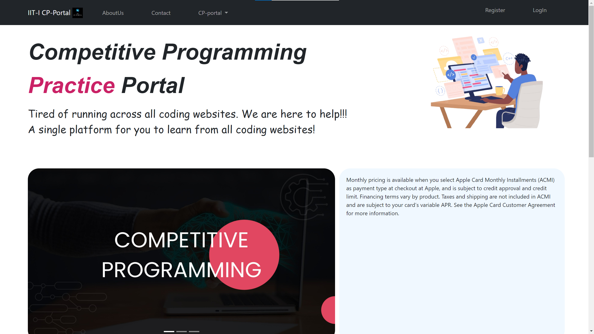
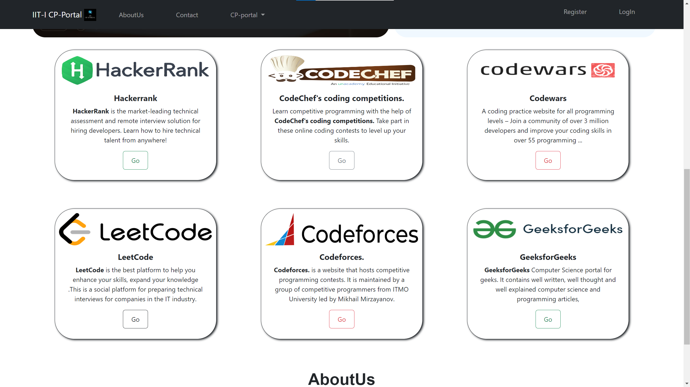
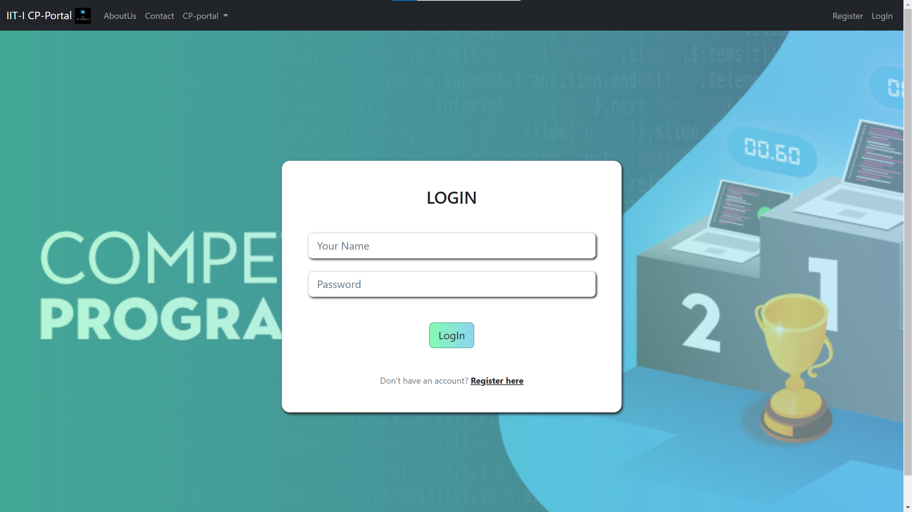
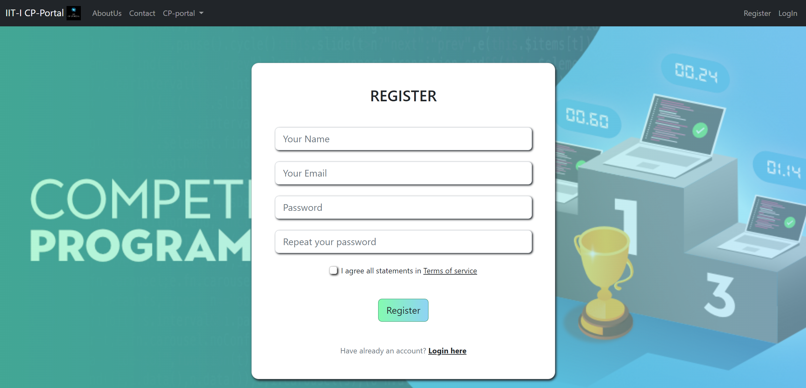

<h1>
IIT-I CP PORTAL
</h1>

web team 6:  
Sai krishna akash ramineni 
Sajan Swaroop Reddy 
Shashivardhan Reddy 
Sai Teja 
TEAM MENTOR:  
Mir Raze 

 
 

Our GitHub Link is https://github.com/rsk9607/IITI-CP-portal

 
 

<h1>
SUMMARY
</h1>

Our Website’s Aim is to ease the process of practicing competitive programming.We made
single website containing all the competitive programming sites.So the user when logged in
Can access all the websites with his credentials which we take during the registering process
of the user in our website.So a user when registers gives all the information related to his
coding websites handles(like username or handle and the password) our aim is to store the
given information in the database and when the user tries to open a coding platform website
say codechef, The request will be sent to the server asking the login credentials of the user for
the website. And we display the logged in page of the coding website.
 
 
 

Salient Features:  
Single webpage containing all the website 
Adaptive website and Responsive Website  

<h1>
TECH STACKS USED
</h1>

<ul>
<li>HTML</li>
<li>CSS</li>
<li>BOOTSTRAP</li>
<li>JAVASCRIPT</li>
<li>NODEJS</li>
<li>EXPRSSJS</li>
<li>MONGODB</li>
<li>MONGOOSE</li>
</ul>
 
 
 

<h1>
TECHNICAL REPORT
</h1>

we used html and css and bootstrap to build our webpages.We created a server using nodejs and express which
when starts, we can host our website locally.We created a database using mangodb and mongoose and then stored
the information of users registered.So we linked the webpages internally and when the server starts one can easily
navigate throughout the website.We dint complete our backened development due to time constraints. Our plan is
to use APIs and retrieve information from the coding sites. And then display them in our website. But for now we
did link the webpages directly using a tags.

 
 

here is our front-end part

 
 

 
 

This is our website on start Adaptable home page

 
 

 
 

This is part of homepage which direct the links to coding websites

 
 

 
 

This are our register page and login page

 
 

<h1>
OUR Experience
</h1>

It offered the chance to gain new
abilities and exploring the new web
development areas as well. It's a
fantastic chance to meet individuals who
care about the same technology and
have the same passion as you do.
Basically, it's a location where you have
the opportunity to work and work with
similar-minded people on projects

<h2>
Thanks
</h2>

